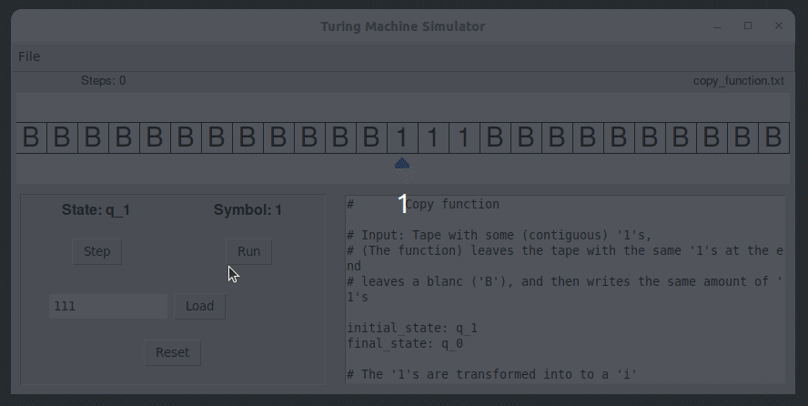

# Turing Machine Simulator

Turing Machine Simulator written in Python using Tkinter.


## Usage

To run the program, on the terminal, move to ```src/``` and execute: 

```
python3 main.py
```

## Demo



